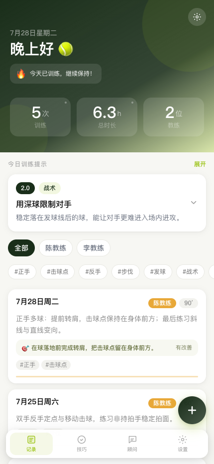
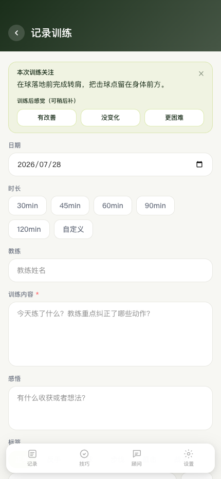
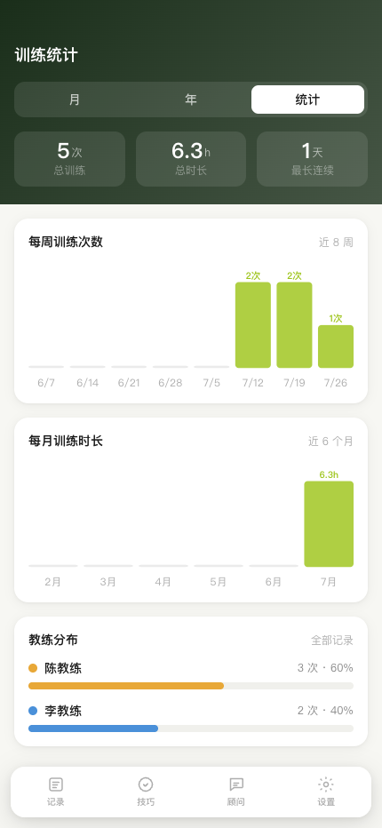

# 网球训练记录

[](https://github.com/Mentran/trainingrecord/actions/workflows/pages.yml)

把每次训练的内容、教练反馈和个人体会留在同一个地方，并把“发现问题”变成下一次可以验证的训练关注点。

**无需登录 · 数据默认留在本机 · 支持离线使用 · AI 功能可选**

👉 [立即在线体验](https://mentran.github.io/trainingrecord/)



> 截图使用隔离的演示数据，仅用于展示当前真实页面，不包含个人训练记录。

## 它解决什么问题

训练结束后，零散笔记很容易只记下“今天练了什么”，却没有形成下一次行动：

- 教练指出的问题散落在聊天、备忘录和脑海里，复盘时找不到。
- 只按日期记流水账，难以看出训练频率、时长和反复出现的问题。
- 知道动作要领，却没有把它变成下一次训练时可观察、可验证的关注点。
- 个人训练数据不适合为了一个轻量记录工具就上传到未知服务。

这个项目把流程收拢成一个本地优先的训练闭环：

```text
记录训练 → 发现问题 → 设定一个关注点 → 下次训练验证 → 继续或调整
```

它首先服务网球训练，也支持创建其他运动项目；不同运动的记录、技巧和对话彼此隔离。

## 核心功能

- **训练记录**：保存日期、时长、教练、训练内容、感悟和标签，支持查看、编辑与删除。
- **训练关注点**：从训练提示带入本次目标，训练后标记“有改善 / 没变化 / 更困难”并补充证据；未改善时可延续到下一次。
- **列表与筛选**：按时间浏览记录，并按教练、标签筛选。
- **日历与统计**：查看月历、年度训练热力图，以及次数、时长、连续训练和教练分布。
- **等级化训练提示**：按当前网球等级，从内置的 60 条本地卡片中推荐正手、反手、发球、步伐、截击和战术练习。
- **技巧笔记**：沉淀动作要点，支持分类、标签、搜索、实用性标记和重复内容整理。
- **备份与恢复**：按类别导出 / 导入 JSON，支持覆盖、按 ID 合并、失败回滚和撤销上次导入。
- **可选 AI**：用户自行配置兼容的 API 地址、Key 和模型后，可使用文本润色、运动顾问和技巧整理；核心记录功能不依赖 AI。
- **PWA**：生产环境可安装到桌面或手机，并缓存已访问的应用外壳供离线打开。

## 关键页面

<p>
  
  
</p>

## 三步使用

1. 打开[在线体验](https://mentran.github.io/trainingrecord/)，直接记录第一次训练。
2. 在首页查看训练提示，选择一个“今日关注”带入下一次训练。
3. 训练后填写结果，并定期在设置页导出 JSON 备份。

## 数据存储与隐私

在线版没有账号和云数据库。训练记录、技巧笔记、运动配置、聊天记录和 AI 配置都保存在当前浏览器的 `localStorage` 中：

- 数据不会由本项目主动上传到业务服务器；清理浏览器数据或更换设备可能导致记录丢失。
- JSON 备份由用户主动导出和保管，可在另一浏览器中导入。
- AI API Key 只保存在当前浏览器，不写入项目 JSON 文件，也不包含在训练备份中。
- 启用 AI 后，请求会从浏览器直接发送到用户配置的 API 地址；不建议在共享设备上保存 Key。
- 本地开发服务可额外同步到 `data/app-data.json` 并保留最近备份；该能力不适用于 GitHub Pages 在线版。

## 本地开发

需要 Node.js 24。

```bash
npm ci
npm run dev
npm run check
```

常用命令：

| 命令 | 用途 |
| --- | --- |
| `npm run dev` | 启动本地开发服务，并启用项目目录 JSON 同步 |
| `npm run lint` | 检查代码规范 |
| `npm test` | 运行数据、AI、存储和训练提示测试 |
| `npm run build` | 生成普通生产构建 |
| `VITE_BASE_PATH=/trainingrecord/ npm run build:pages` | 验证 GitHub Pages 子路径构建 |

推送到 `main` 后，GitHub Actions 会依次执行 Lint、测试、Pages 构建和部署。

## 当前边界

- 没有账号、云同步和自动跨设备合并；当前浏览器是在线版数据的唯一自动存储位置。
- GitHub Pages 是静态托管环境，不能使用开发服务的项目目录 JSON 写入能力。
- AI 功能依赖用户提供的兼容接口、可用额度和跨域设置；AI 输出可能出错，应用前应自行判断。
- 训练提示用于帮助记录和复盘，不替代现场教练、医疗诊断或伤病处理建议。
- 多运动管理已经可用，但内置的等级化提示内容目前以网球为主。

## 后续方向

- 更清晰的周 / 月复盘，把反复未改善的问题集中呈现。
- 在不增加录入负担的前提下完善训练趋势与关注点效果统计。
- 先定义冲突和迁移策略，再评估可选的云同步。
- 根据真实使用需求评估 PDF 训练报告，而不是预设复杂模板。

## 项目记录

- [项目审计与执行记录](docs/PROJECT_AUDIT_2026-07-10.md)
- [功能任务清单](TODO.md)
